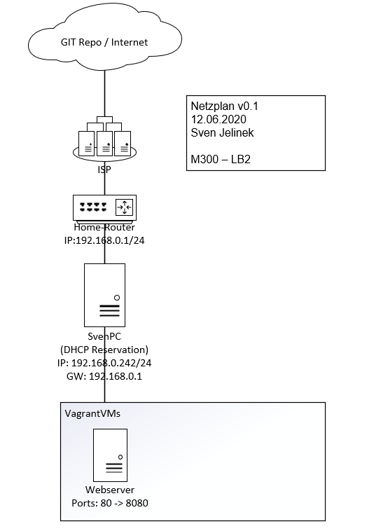
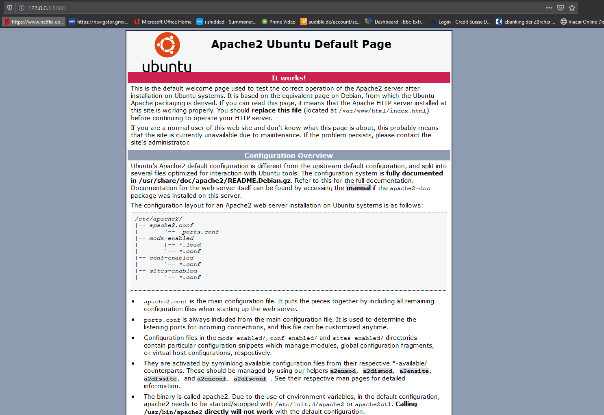
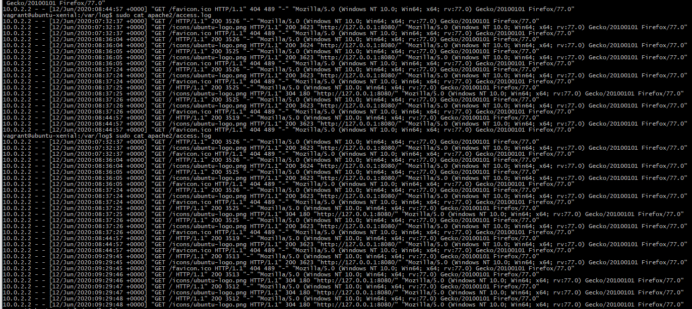

# M300-Services Moduldokumentation
## **LB2**
### **Ziel**
Das Ziel ist es ein Webserver mit Vagrant zu realisieren. Dieser soll zusätzlich mit diversen Sicherheitsaspekten geschützt werden. 

### **VagrantVM**

Die VagrantBox ist ein normales Ubuntu Xenial64 aus dem Vagrant-Repository. Die Box wird das mit dem Vagrantfile angepasst, was wir auch benötigen um den Webserver zu installieren und Konfigurieren. Die folgenden Zeilen sind für den Webserver besondern wichtig:

* config.vm.network "forwarded_port", guest:80, host:8080 = Webseite auf Port 8080 verfügbar
* config.vm.synced_folder ".", "/var/www/html" = Erlaubt es uns die ganze Webseite direkt auf dem Localhost zu bearbeiten. Alle Änderungen werden direkt auf den Webserver synchronisiert. 

Code Vagrantfile:

```ruby
Vagrant.configure(2) do |config|
  config.vm.box = "ubuntu/xenial64"
  config.vm.network "forwarded_port", guest:80, host:8080, auto_correct: true
  config.vm.synced_folder ".", "/var/www/html"  
config.vm.provider "virtualbox" do |vb|
  vb.memory = "512"  
end

config.vm.provision "shell", inline: <<-SHELL
  sudo apt-get update
  sudo apt-get -y install apache2 
SHELL
end
```

### **Netzplan**



### **Testing**

#### Verfügbarkeit Webseite
Als erstes testen wir ob die Webseite überhaupt aufrufbar ist. Dafür geben wir folgendes im Webbrowser ein: "127.0.0.1:8080". Da wir noch nichts am Index.html geändert haben, sollte nun die Apache-Standardseite angezeigt werden. 

**Testergebnis: OK**



#### Log
Wir wollen das jede Anfrage an den Webserver geloggt wird. Dafür rufen wir den Log zweimal auf und machen dazwischen einigen Requests auf den Webserver. Auch diese Anfragen sollen im Log angelegt sein.

**Testergebnis: OK**


